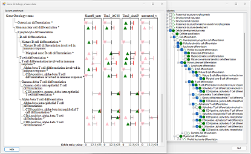

# GOTermVeiwer
#### Contents
- [Introduction](#Introduction)
- [Guide](guide)
- [Download](program)
- [Running on Linux and masOS](#running-on-linux-and-masos) 
- [Citation](#citation)

## Introduction

Gene Ontology (GO) terms represent a highly organised description of biologiacl activity with many genes' functions described using GO terms either as a result of direct experimental observation or by sequence homology to protiens with know functions. While the current annotation has its limitations, GO terms can still be very useful when describing biological phenomena such as attempting to determine a cells physiological response to stimuli or genetic mutation. 

The analysis of gene expression microarrays and NGS RNAseq is routinely preformed to identify changes in expression profiles between various cohorts of biological material. However, simple lists of differentially expressed genes can often be too large to be easily used to describe any changes in physiology. To resolve this issue a number of applications have been developed that link differentially expressed genes (DEG) to their GO terms and then determine if a GO term is linked to more or less genes in the dataset than expected. One such application is the R package GOstats which has been cited over 2000 times since its publication in 2007:

> Falcon S, Gentleman R (2007). “Using GOstats to test gene lists for GO term association.” Bioinformatics, 23(2), 257-8.

This R package compares two lists of genes and determines if a GO term is under or over represented in one list when compared to the other reference list. GO terms that are significantly over or under enriched can then be exported along with their level of significance as measured by their p value and odds ratio value along with the number of genes linked to the term and the expected number of genes for a comparably sized random list of genes.

While these lists are very useful, as with the DEG lists, GO term list can be difficult to interpret especially when comparing enrichment from different experiments, consequently we have developed GOTermViewer which will display enrichment data for a user selected list of GO terms forma a number of different analysis’s.

## Guide

The GOTermVeiwer guide is [here:](guide)

## Download

The compiled can be downloaded from [here:](program)

## Running on Linux and masOS

While GOTermVeiwer is targeted to run on Windows computers it is possible to run it on a range of Linux, BSD and Apple computers using Wine as described here:

* [Running Windows programs on Linux or masOS](https://github.com/msjimc/RunningWindowsProgramsOnLinux).

## Citation

> [Volpato M, Hull M, Carr IM. GOTermViewer: Visualization of Gene Ontology Enrichment in Multiple Differential Gene Expression Analyses. Bioinform Biol Insights. 2024 Sep 18;18](https://pmc.ncbi.nlm.nih.gov/articles/PMC11418229/)

