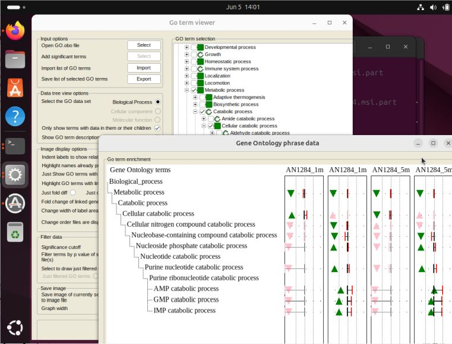

# GOTermViewer
### Contents
- [GOTermViewer](#gotermviewer)
    + [Contents](#contents)
  * [Background](#background)
  * [GOTermViewer requirements](#gotermviewer-requirements)
    + [Computer](#computer)
    + [GO term data](#go-term-data)
    + [Data](#data)
  * [Searching for specific GO Terms](/guide/FindTerm.md)
  * [Viewing data](#viewing-data)
    + [Importing data](#importing-data)
    + [Configuring GO term tree view](#configuring-go-term-tree-view)
    + [Selecting and displaying GO term enrichment data](#selecting-and-displaying-go-term-enrichment-data)
      - [Scrolling through the image](#scrolling-through-the-image)
    + [Display format of enrichment data](#display-format-of-enrichment-data)
    + [Modifying the GO term display](#modifying-the-go-term-display)
      - [Changing the indentation of the GO term text](#changing-the-indentation-of-the-go-term-text)
      - [Identifying terms that occur multiple times](#identifying-terms-that-occur-multiple-times)
      - [Hiding terms not linked to data](#hiding-terms-not-linked-to-data)
      - [Identifying terms with linked data](#identifying-terms-with-linked-data)
      - [Changing the displayed data](#changing-the-displayed-data)
      - [Changing the x-axis legend](#changing-the-x-axis-legend)
      - [Changing the width of the GO term text area](#changing-the-width-of-the-go-term-text-area)
      - [Changing the order and or renaming the analysis data files in the display](#Changing-the-order-and-or-renaming-the-analysis-data-files-in-the-display)
      - [Reordering Terms in the display](#Reordering-Terms-in-the-display)
      - [Hiding terms from the display image](#Hiding-terms-from-the-display-image)
    + [Filtering the data based on its p value](#filtering-the-data-based-on-its-p-value) 
      - [Change the p value cutoff](#change-the-p-value-cutoff)
      - [Filter terms by p value of specified files](#filter-terms-by-p-value-of-specified-files)
  * [Saving the analysis to an image file](#saving-the-analysis-to-an-image-file)
  * [Exporting and importing selected GO terms]
  * [Running GOTermViewer on macOS and Linux](#running-gotermviewer-on-macos-and-linux)
  (#exporting-and-importing-selected-go-terms)

<small><i><a href='http://ecotrust-canada.github.io/markdown-toc/'>Table of contents generated with markdown-toc</a></i></small>

## Background
Gene ontologies are an evolving set of phrases used to define proteins with respect to their biological process, molecular function or cellular compartment. The phrases or gene ontology terms (GO terms) are ordered in a hierarchical manner similar to a tree and are currently annotated by the [Gene Ontology Consortium](http://geneontology.org/). 

> Ashburner et al. Gene ontology: tool for the unification of biology. Nat Genet. 2000 May;25(1):25-9. DOI: 10.1038/75556
> 
> The Gene Ontology Consortium. The Gene Ontology knowledgebase in 2023. Genetics. 2023 May 4;224(1):iyad031. DOI: 10.1093/genetics/iyad031

The base of the tree consists of terms with vaguer, generic meanings such as ‘Growth’ or ‘Immune system process’ each of which catches a wide range of processes. These terms are then linked to more specific child terms such as 

‘Growth’ > ‘Cell growth’ 

or  

‘Growth’ > ‘Developmental growth’,

with ‘Growth’ being a parent term to its child term ‘Cell growth’. These in turn are linked to even more specific terms such as 

‘Growth’ > ‘Developmental growth’ > ‘Developmental cell growth’ 

and 

‘Growth’ > ‘Developmental growth’ > ‘Developmental growth involved in morphogenesis’.

While in principle the arrangement is simple, in practice it can become complex as a term may have more than one parent term. For instance ‘Developmental cell growth’ is linked to both ‘Developmental growth’ and ‘Cell growth’

‘Growth’ > ‘Developmental growth’ > ‘Developmental cell growth’

and 

‘Growth’ > ‘Cell growth’ > ‘Developmental cell growth’

Proteins are linked to GO terms either through direct experimental investigation or by sequence or structural homology to a protein that has been previously linked to a term. Consequently, while it may seem logical that a protein linked to a term will also be linked to that terms parent term(s), this is not explicitly stated. 

While the current usage of GO terms has its limitations, they can still be very useful when describing biological phenomena such as attempting to determine a cells physiological response to stimuli or genetic mutation. The analysis of gene expression microarrays and NGS RNAseq is routinely preformed to identify changes in gene expression profiles between various cohorts of biological material. However, simple lists of differentially expressed genes can often be too large to be easily used to describe any changes in sample physiology. To resolve this a number of applications have been developed that link differentially expressed genes (DEG) to their GO terms and then determine if a GO term is linked to more or less genes in the dataset than expected, when compared to how common that term is in a reference gene set such as all the genes expressed in a sample or those present in the organism’s genome. One such application is the R package s which has been cited over 2000 times since its publication in 2007:

> Falcon S, Gentleman R (2007). “Using s to test gene lists for GO term association.” Bioinformatics, 23(2), 257-8.

This R package compares two lists of genes and determines if a GO term is under or over represented in one list when compared to the other reference list. GO terms linked to genes in the DEG list that are significantly over-or under-enriched can then be exported along with their level of significance as measured by their p value and odds ratio value along with the number of genes linked to the term and the expected number of genes for a comparably sized random list of genes.

While these lists of GO terms are very useful, as with the DEG lists, GO term list can be difficult to interpret especially when comparing enrichment from different experiments, consequently while a number of applications have been written to visualise GO terms enriched for a single analysis, we have developed GOTermViewer which will display enrichment data GO terms form a number of different analyses.

## Searching for specific GO Terms

Since finding the desired GO Term may be difficult, GOTermViewer as two search functions as described [here:](/guide/FindTerm.md)

## GOTermViewer requirements
### Computer
GOTermViewer is written in C# which can run on any Windows computer and may be possible run on a Linux or Mac with a suitable framework such Wine environment (https://www.winehq.org/). 

### GO term data
A list of GO terms with their relationship such as the go.obo file from the Gene Ontology download page (http://geneontology.org/docs/download-ontology/ select the 'Generic GO dataset in the OBO format).     
The Sept 2023 version is here: [go.obo](/guide/example_data/go.zip).  

### Data
Finally, the program requires the list of GO terms linked to your differential analysis experiments as exported by s. This requires a list of differentially expressed genes which for RNAseq experiments this may be generated by application such as the R packages DeSeq2 (https://bioconductor.org/packages/release/bioc/html/DESeq2.html) or EdgeR (https://bioconductor.org/packages/release/bioc/html/edgeR.html) each of which have been cited over 52,000 and 36,900 times since publication. The list of DEG is then imported in to s along with of reference genes using a command similar to this:

_params <-new ('GOHyperGParams', geneIds=DEG, universeGeneIds=reference.genes, annotation=Species, ontology='BP', pvalueCutoff=1, conditional=TRUE,testDirection="over")_
         
where:

**geneIds**: is the list of differentially expressed genes

**universeGeneIds**: is a list of reference genes

**annotation**: is the relevant R annotation package  for the organism from which the samples were derived e.g. org.Mm.eg.db

**ontology**: is the subset of GO terms you wish to use e.g. BP for biological process, MF for molecular function and CC for cellular compartment.

**pvalueCutoff**: the fresh hold for the retention of data. Since GOTermViewer compares and filters data from a number of experiments this should be set to 1 to obtain as much data as possible.

**condition**: If set to TRUE s will use the information present in the terms parent terms as well as their children to test for significance. While, if set to FALSE only data linked to child terms will be used. 

**testDirection**: if set to ‘over’ returns terms overrepresented (induced functions) in the DEG list, while setting it to ‘under’ returns terms underrepresented (deactivated functions).

Once the params dataset is created it can be written to file using the following commands:

_go <- hyperGTest(params)_

_go.table <-summary(go, pvalue=2)_

_write.table(go.table, file = MyFile.xls, sep="_", append = FALSE, quote = FALSE, sep = "\t", eol = "\n", na = "NA", dec = ".", row.names = TRUE, col.names = TRUE, qmethod = ("escape", "double"), fileEncoding = "")_

Unlike the first command, these don’t require any modification except the text ‘MyFile.xls’ should be change to the name of the file (but retain the .xls file extension) you wish to save the data too. This should produce a file with the structure shown below:

| | GOBPID | Pvalue | OddsRatio | ExpCount | Count | Size | Term |
| --- | --- | --- | --- | --- | --- | --- | --- |
| 1 | GO:0044419 | 7.67E-38 | 7.284965 | 20.64939 | 92 | 769 | biological process involved in interspecies interaction between organisms |
| 2 | GO:0043207 | 2.91E-31 | 7.833862 | 13.21026 | 68 | 529 | response to external biotic stimulus |
| 3 | GO:0035458 | 3.81E-25 | 51.29674 | 1.049442 | 22 | 39 | cellular response to interferon-beta |
| 4 | GO:0071310 | 3.81E-17 | 3.84663 | 25.42141 | 72 | 954 | cellular response to organic substance |

$\textcolor{red}{\textsf{Important note}}$ 

To include terms that are either over- or under- represented in the DEG dataset, the enrichment step needs to be run twice, once with:

_params <-new ('GOHyperGParams', geneIds=DEG, universeGeneIds=reference.genes, annotation=Species, ontology='BP', pvalueCutoff=1, conditional=TRUE,testDirection="<ins>over</ins>")_

and again with

_params <-new ('GOHyperGParams', geneIds=DEG, universeGeneIds=reference.genes, annotation=Species, ontology='BP', pvalueCutoff=1, conditional=TRUE,testDirection="<ins>under</ins>")_

and the files manually combined to form a single file where the file of overrepresent terms is appended to the file of underrepresented terms (the order is not important). The resultant file may contain the same term twice, in which case GOTermViewer will retain the instance with the smallest p value. 

## Viewing data
### Importing data
The opening form of GOTermViewer (Figure 1) contains just two active buttons, the Quit button, used to shut down the program and the Select button, which is used to select the GO term file (*.obo). 

Figure 1

### Configuring GO term tree view
After the GO term file is uploaded, 3 root nodes appear in the righthand panel each representing one of the groups of GO terms and the 2nd Select button will become active (Figure 2). Since GOTermViewer is designed to display data from several data files, pressing this button prompts you to select a folder that should only contain the tab-delimited text files (with the .xls extension) you want to view.

Figure 2

Before processing the data, GOTermViewer will prompt you to enter a p value cut off value (Figure 3). If a term contains at least one data point below this cut off, that term will be considered to contain data. If no data point is below this value, the term will be ignored as all the data will not be statistically significant. 

Figure 3

Once this cut off value has been supplied, GOTermViewer will process each file in turn before activating the entire form and opening the Gene Ontology phrase data form which is discussed in greater detail below (Figure 8). Each GO term is added as a node to one of the three root nodes mirroring the hierarchic of the GO terms. If there is no data linked to a GO term, its node is displayed as a pink disc. If a GO term as no data, but one of its child terms does, the node has a green circle. Nodes that are directly linked to data in one or more of the data files have a green disc (Figure 4).

Figure 4

While three root nodes are displayed it is only possible to view terms in one node at a time, with the required node activated by selecting the appropriate option in the ‘Data tree view options’ panel (Figure 5 options A to C). If a node contains no data, the linked option will be disabled.

Figure 5

The ‘Data tree view options’ panel contains 5 options whose selection causes the nodes to be redraw, consequently changing these options results in the GO term nodes been completely recreated and so should be done at the very start of the analysis as any node selection may be lost.

GOTermViewer is designed to visualise data from only one GO term set at a time with the first three options in the ‘Data tree view options’ panel (Figure 5, options A to C) used to select the required set. As GO term data is imported, it is noted which GO term sets have data with the root nodes and the selection options in the ‘Data tree view options’ panel are disabled for GO terms sets without data.

By default, nodes that have no linked data at all are hidden, but can be displayed by deselecting the ‘Only show terms with data in them or their children’ option (Figure 5, options D).

Figure 6

It’s possible to display a term’s description by placing the mouse cursor over its node (Figure 7), but since this can be distracting it's turned off by default, but can be enabled by selecting the ‘Show GO term descriptions’ option (Figure 5, option E).

Figure 7

### Selecting and displaying GO term enrichment data
After GOTermViewer has processed the data, it displays the ‘Gene Ontology phrase data’ display window (Figure 7). This window consists of a single image in the ‘Go term enrichment’ panel and is intended purely for data display with no selectable options other than a vertical scroll bar to the right of the image as described below. Ideally, on a multi-screen computer, this window will be displayed on a different monitor to first window, allowing changes to this display to be seen as options are selected on the primary window.  

Figure 8

Initially, this form displays no GO term specific data and consists solely of a region to the left where the GO phrases will be displayed and a series of rectangles to the right, each representing a data file. As GO terms are selected in the primary window (Figure 9), their data appears in the display window (Figure 10) with the GO term phrases indented to show their relationship with flanking terms.  

Figure 9a

Figure 9b

#### Scrolling through the image
As GO terms are selected, the height of the list of terms increases until it greater than the height of the image, at which point it becomes possible to scroll through the GO terms using the scroll bar to the right of the image (Figure 9b). While it is possible to scroll the image, you should remember that the resultant image shouldn't be so large that it cannot be easily viewed on a computer screen when saved to an image file.

### Display format of enrichment data
For each GO term in a data file, GOTermViewer retains the p value and the odds ratio value that quantifies the significance of the enrichment, as well as the number of genes linked to each term as well as the expected number. Since the expected number of genes linked to a term depends on the number of genes in the DEG data set, GOTermViewer displays the folder change rather than the actual numbers, is found by dividing the number of genes linked to a term by the expected number. 

Figure 10

Figure 10 shows the enrichment data for 6 GO terms in 4 linked analyses. Of these terms all contain data except for the ‘B cell differentiation’ and ‘mature B cell differentiation involved in immune response’ terms. If more genes are linked to a GO term than expected the triangle points upwards, while if there are fewer the triangle points down. Similarly, if the difference between the expected number and observed number is statistically significant the triangle is drawn in green, while non-significant terms are drawn in pink. The p value cutoff can be adjusted via the ‘Significance cutoff’ option in the ‘Filter data’ panel (see section: Filtering the data based on its p value). The horizontal location of the triangle is determined by the value of the data’s odds ratio, with the x - axis scale ranging from a value of 0 to 25 (see Changing the x-axis scale). If an odds ratio value is greater than 25 it is placed as if its value was 25.  
Each data line also shows the fold difference between the expected number of genes linked to a term and the observed number. The scale ranges from 1/10th the expect number to 10 x the number. The centre point (no difference) is marked by a vertical line (black if the difference is significant, grey if it isn’t), while the fold difference is shown by a 2nd vertical line (red if the difference is significant, pink if it isn’t) either to the left of the centre (few genes linked to the term than expected) or to the right (more genes linked to the term than expected).

$\textcolor{red}{\textsf{Important note}}$ 

s predicts the number of genes in a dataset that it expects to be linked to a specific GO term and compares this to the actual number in the dataset when testing for enrichment. However, sometimes the expected number may be a value between 0 and 1 and if no genes are found linked to the term the resultant fold change is both miss leadingly large and statistically insignificant. 

### Modifying the GO term display
The ‘Image display options’ panel (Figure 11) on the primary window contains a number of options that change the way the data is displayed as follows.

Figure 11

#### Changing the indentation of the GO term text

By default the GO terms are indented to reflect the structure of the tree, with all terms displayed irrespective of the presence of linked data. A dotted line to the left of the text highlights the relationships between parent and child terms. To remove the indentation deselect the 'Indent labels to show relationships' option (Figure 11 row A).

Figure 12

#### Identifying terms that occur multiple times
As stated in the introduction, a term may have one or more parent terms which makes drawing a simplified tree view of the terms difficult. Consequently, terms (and their children) with multiple parent terms will appear 2 or more times in the GO term tree, once for each parent. To highlight terms that have already appeared in the image the phrase is drawn in red (Figure 13a). These terms can be removed from the image by deselecting the unwanted instance(s) of the term (Figure 13b).

Figure 13a

Figure 13b

However, if it is preferable to contain two or more instances of the same GO term, the phrase can be written in black by deselecting the ‘Highlight names already present in the image’ option (Figure 11 row B)

Figure 14

#### Hiding terms not linked to data

To hide terms that lack data select the ‘Just show GO terms with data’ option (Figure 11 row C). This also as the effect of disabling the ‘Highlight Go terms with linked data’ option as all displayed terms have data (Figure 15).

Figure 15

#### Identifying terms with linked data
In the default setting all terms are displayed irrespective of whether they are linked to data. Terms with linked data can easily be identified by the presence of an asterisk after their phrase text. Deselecting the ‘Highlight GO terms with linked data’ option in the ‘Image display options’ panel will remove the asterisk (Figure 11 row D), compare Figure 16a to Figure 16b). 

Figure 16

#### Changing the displayed data

The displayed data consists of the odds ratio value and the fold change in the number of genes linked to a term relative to the expected number. By Default both sets of data are displayed (Figure 17 a), however it is possible to display either just the fold change data (Figure 17b) or just the odds ratio values (Figure 17c), by selecting the appropriate option in the 'Image display options' panel (Figure 11 row E). 

Figure 17a

Figure 17b

Figure 17c

Figures 10A and 10B differ only in the labelling of the x-axis, in Figure 10A the axis represents the folder difference between the number of genes linked to a term and the expected number. The scale ranges from 1/10th to 10 x. In Figure 10B the vertical lines represent the odds ratio and are drawn at 0 to >25 . The axis scaling can be changed by selecting either the ‘Fold change of linked genes’ or ‘Odds ratio’ options in the ‘Image display options’ panel (Figure 11 row F).

#### Changing the x-axis legend
Figure 18 shows data with the x – axis scaled to the fold difference of genes linked to a term compared to the expected number and can be changed to the odds ratio value by selecting either the ‘Fold change of linked genes’ (Figure 18a) or the ‘Odds ratio’ (Figure 18b) check box in the ‘Image display options’ panel (Figure 11 row F). This doesn't affect the scaling it just changes the text.  

Figure 18a

Figure 18b

#### Changing the width of the GO term text area
Each GO term phrase is written to the left of the image, if a phrase is longer than the given space it will be broken in to two lines. However, if the space is still two short, the text will overflow on to the graphs. Consequently, it’s possible to adjust the allotted space for the GO term phrase via the ‘Change width of label area’ option (Figure 11 row G). Changing this value will also affect the area allocated to the graph(s) on the right of the image in the form (Compare Figure 19a to Figure 19b).

Figure 19a

Figure 19b

#### Changing the order and or renaming the analysis data files in the display
The initial order of the analysis files is determined by the name of the data file; however their order and display name can be changed by pressing the ‘Reorder’ button at the bottom of the ‘Image display options’ panel (Figure 11 row G). This will open a form with two dropdown lists and a single text area (Figure 20a).

Note: If a file is omitted, its data will not be displayed, but can be reintroduced by repeating the reordering process and including it. 

Figure 20a

To reorder the files, select the file names from the upper list and press the ‘Select’ button in the order you want them drawn. As the files names are selected, they will move from the upper list to the lower list (Figure 20b).

Figure 20b

 As each file appears in the lower list, its current display name will appear in the lower text area. To change the display name, simply edit the text in this text area (Figure 20c). 

Figure 20c

To accept the new order and display names press the ‘Accept’ button and data will be redraw in the desired order (figure 20d). If a file is omitted, its data will not be displayed, but can be reintroduced by repeating the reordering process and including it. 

Figure 20d

#### Reordering Terms in the display

Child terms are arranged alphabetically; however it may be more informative if the order of the child terms were ordered differently. Consequently, it's possible to move a term up or down relative to other terms linked to the same parent term. For instance in Figure 21, it may be desirable to draw the pyrimidine ribonucleoside terms before the purine ribonucleoside terms. 

Figure 21

To move a term, first select the term in the tree view so that the text is white against a blue background (in windows default colour scheme) and then right click on the tree view (Figure 22) and either click the 'Move term up' or 'Move term down' as required.

Figure 22

The tree view will then be redrawn with the selected node moved by one position relative to other terms with the same parent (Figure 23). When reordering terms, the terms children will still be visible, but their children may be collapsed and you may need to click on each term for it to display its children again. 

Figure 23

Similarly, the terms will be reordered in the display (Figure 24).

Figure 24

#### Hiding terms from the display image

By default, GOTermViewer includes all selected terms as well as their parent terms. However, this may cause unwanted terms to be included in the final image (Figure 25a).

Figure 25a

To move a term, first select the term in the tree view so that the text is white against a blue background (in windows default colour scheme) and then right click on the tree view (Figure 25b) and  click the 'Hide/Unhide term's data' (Figure 25b). 

Figure 25b

This will draw a diagonal red line across the nodes image (Figure 25c) and the term will be removed from the display (Figure 25d). To display a hidden term, repeat the process.

Figure 25c

Figure 25d

###  Filtering the data based on its p value
The ‘Filter data’ panel contains two functions (Figure 21a): 

#### Change the p value cutoff

The first changes the p value ‘Significance cutoff’ (Figure 26a) that changes the cut-off point at which a GO Term’s enrichment is deemed significant, this change is reflected in the display (Figure 26b and Figure 26c pvalue 0.05 to 0.01). This value can be any decimal number between 0 and 1, if an invalid value is entered it will be reset to 0.05.

Figure 26a

Figure 26b

Figure 26c

#### Filter terms by p value of specified files
The ‘Filter terms by p value of specific file(s)’ option allows the data to be filter, such that only data is displayed if the p value in one or more files is less than the p value cut off. (If the p value is changed the data must be refiltered). To filter the data, press the ‘Filter’ button in the ‘Filter data’ panel and select the required file(s) in the upper dropdown list and press the ‘Select’ button (Figure 27a). Once the file(s) have been selected accept the changes by pressing the ‘OK’ button. To remove any filtering, press the ‘Filter’ button again and either press the ‘Cancel’ button or select no files and press ‘OK’. If the data is filtered the ‘Just filtered GO terms’ option will be enabled and selected: by toggling between this and the ‘All data’ options will cause the display to show the filter or unfiltered data.

Figure 27a

Figure 27b

Figure 27c

## Viewing the underlying data

While GOTermViewer displays an accurate representation of the data exported by GOstats, it is important to realise that this can be misleading. For instance in dataset with few differentially expressed genes the expected number of genes linked to a GO term may be very small (i.e. 0.25), in which case a data set may be expected to have either 0 or 1 gene linked to the term, but the folder change values will be either < 1/10th or 4, both of which would imply a significant change, however the p value will suggest the change is not significant. Consequently, to aid the understanding of the data it’s possible to view the data values by clicking on the image (Figure 28). The displayed data consists of values labelled OR, p, O and E which represent the odds ratio (OR), p value (p), observed number of genes linked to a term (O) and the expected number of genes (E). This information is designed to give you an idea of the underlying data and if necessary you should look in the files exported by GOstats. To aid the data presentation, these values are truncated to 2 decimal places for the odds ratio and p vale, and 1 decimal place for the expected number of genes and not rounded up so a value of 0.049 will be displayed as the a truncated 0.04 and not rounded up value of 0.04.
To return to the image click on the image for a second time. If the image is saved with the numeric values are shown, the exported image will contain the values and not the graphic.  
  

Figure 28

## Saving the analysis to an image file
Once all the required GO terms have been selected, it’s possible to save the display image to file by pressing the ‘Save’ button in the ‘Save image’ panel (Figure 29). This will copy the image format of the image in the display window with the exception that the width of each of the rectangles is set via the ‘Graph width’ option of the ‘save image’ panel. Typically, the value of this option matches the width of the rectangles in the display unless it is less than 50 or greater than 1000. To modify this value simply select the current value and then type the new value. If size of the 'Gene Ontology phrase data' window is changed or the 'Change width of label area' value is modified, changes to the ‘Graph width’ option will be overwritten. 

Figure 28

While the size of the image is not constrained by the size of the program's interface, it is sensible to limit its height such that it can be easily viewed on a monitor. The current maximum image height is limited to 32,000 pixels.

## Exporting and importing selected GO terms 
It is possible to save all the selected GO terms as a series of paths to file by pressing the ‘Export’ button on the ‘Input options’ panel. This list can then be imported using the ‘Import’ button on the ‘Input options’ panel allowing an analysis to be resumed at a later date. However, due to the differences in the underlying list of DEGs, the GO terms may differ noticeably between different sets of differential expression experimental data sets. Consequently, it may be unwise use the same GO term list between different sets of expression data. 

## Running GOTermViewer on macOS and Linux

While GOTermViewer is a Windows application, when used with Wine it will work on a range of operating systems (Figure 29). For most operating systems Wine can be installed via a package manager as described on Wine's [web site](https://www.winehq.org) and in this [GitHub repository](https://github.com/msjimc/RunningWindowsProgramsOnLinux). 

Figure 1: GOTermViewer running on Ubuntu (24.4) with Wine 9.0