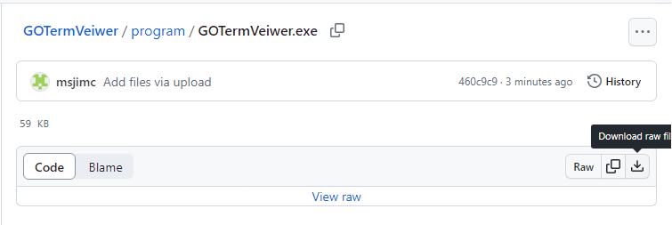
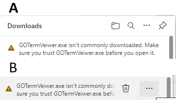
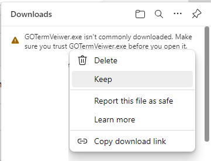
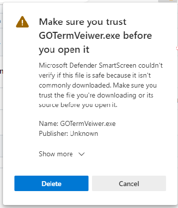
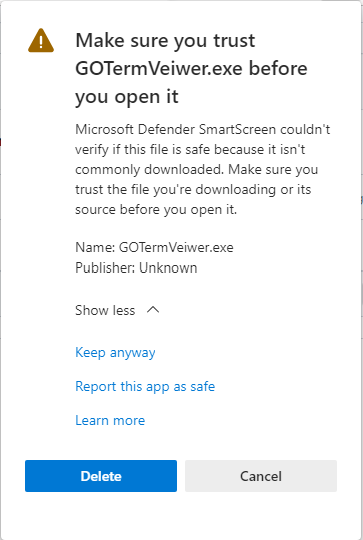

# GOTermVeiwer
This folder contains the precompiled program which you can download and run. However, due to the current security measures in windows, you will have to ignore several warning designed to stop people downloading possibly dangerous programs. 

First click on the program file (GOTermVeiwer.exe in the table above) which will take you to a new page, on the upper righthand corner click on the icon of a tray with an arrow pointing to it. This will then start the download which will ultimately get you to the first warning (Figure 2).

Figure 1

Move the mouse to the right of the message and three dots will appear next to a bin icon (Figure 2B), click on the dots.

Figure 2

Next select 'Keep' (Figure 3)

Figure 3

On the next warning, click on the 'Show more' label (Figure 4)

Figure 4

And finally, select the 'Keep anyway' option (Figure 5) and the download will start.

Figure 5
